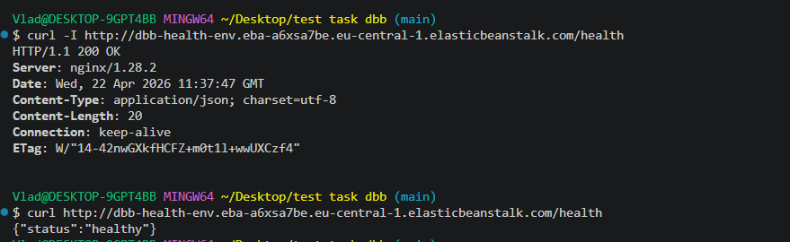
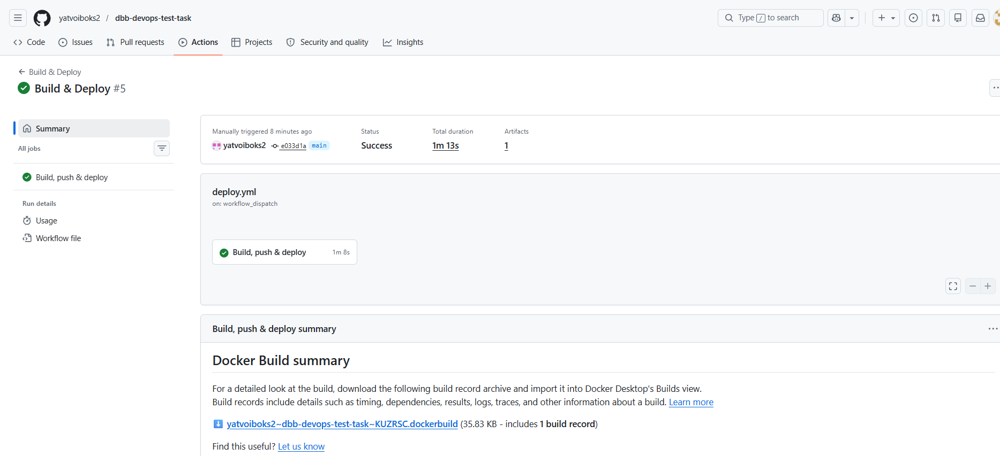
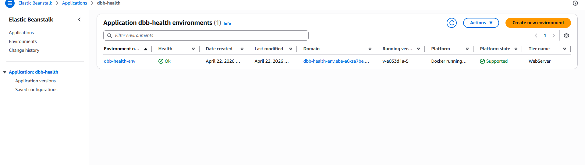
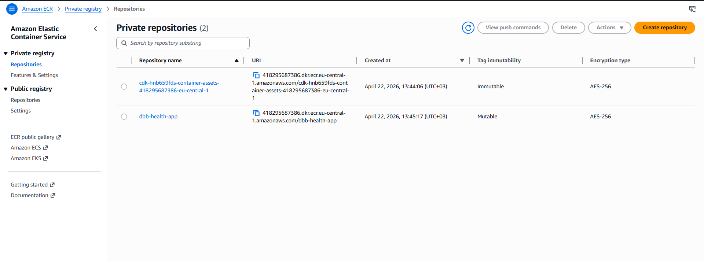

# DBB Software — DevOps Test Task

Dockerized Node.js web app deployed to AWS Elastic Beanstalk from an ECR image,
with infrastructure provisioned via AWS CDK (TypeScript) and a GitHub Actions
CI/CD pipeline.

## Live demo

- Environment URL: http://dbb-health-env.eba-a6xsa7be.eu-central-1.elasticbeanstalk.com
- Health endpoint: http://dbb-health-env.eba-a6xsa7be.eu-central-1.elasticbeanstalk.com/health

```
$ curl -i http://dbb-health-env.eba-a6xsa7be.eu-central-1.elasticbeanstalk.com/health
HTTP/1.1 200 OK
Server: nginx/1.28.2
Content-Type: application/json; charset=utf-8
Content-Length: 20

{"status":"healthy"}
```

## Deliverables (screenshots)

| # | What                                              | Image                                                                    |
| - | ------------------------------------------------- | ------------------------------------------------------------------------ |
| 1 | `curl -i /health` → `200 OK` + JSON body          |                       |
| 2 | GitHub Actions "Build & Deploy" pipeline success  |         |
| 3 | Elastic Beanstalk environment — `Ready/Ok`, running `v-e033d1a-5` |  |
| 4 | ECR repository `dbb-health-app` (mutable tags, AES-256) |                       |

## Architecture

```
                 ┌──────────────────────────┐
  GitHub push ──►│  GitHub Actions (OIDC)   │
                 └─────────┬────────────────┘
                           │ assume role
                           ▼
              ┌──────────────────────────────┐
              │  AWS account (eu-central-1)  │
              │                              │
 docker push  │   ┌──────┐      ┌─────────┐  │
  ───────────►│   │ ECR  │◄─────┤  EC2    │  │
              │   └──────┘ pull │ in EB   │  │
              │                 │ single- │  │
              │                 │ instance│  │
              │   ┌──────┐      └─────────┘  │
              │   │  S3  │  app version       │
              │   └──────┘  bundles           │
              └──────────────────────────────┘
                           ▲
                           │ http://<env-url>/health
```

### Components

- `app/` — minimal Node.js (Express) service, `GET /health → {"status":"healthy"}`, port 8080.
- `app/Dockerfile` — multi-stage Alpine build, runs as non-root, tini as PID 1.
- `cdk/` — two mandatory CDK stacks + one optional:
  - **EcrStack** — ECR repo, scan on push, lifecycle (keep 10, expire untagged > 1d).
  - **BeanstalkStack** — VPC (public, no NAT), SG (80/443), IAM roles
    (instance profile + service role), S3 bucket for app versions,
    EB application + single-instance environment on Docker-on-AL2023.
  - **GithubOidcStack** (optional) — `token.actions.githubusercontent.com`
    OIDC provider + scoped deploy role. Only synthesized when
    `--context githubRepo=owner/repo` is provided.
- `.github/workflows/deploy.yml` — builds image, pushes to ECR, creates a new
  EB application version and rolls it out. Uses OIDC (no static keys).

### Note on the task specification

The PDF's *Submission* section mentions ECS, RDS and a `/db-test` endpoint —
none of which appear in the *Task description* (which only asks for Elastic
Beanstalk + `/health`). This looks like a copy-paste from a different template.
This repository implements the *Task description* strictly (Parts 1–3).

## Prerequisites

- Node.js 20+, Docker, AWS CLI v2, an AWS account with credentials configured
  (`aws configure` → `aws sts get-caller-identity` must succeed).
- For CDK: `npm i -g aws-cdk` or use the one bundled in `cdk/package.json`
  (`npx cdk ...`).

## 1. Initial deployment

```bash
cd cdk
npm install

# one-off per account/region
npx cdk bootstrap

# (1) create ECR first
npx cdk deploy dbb-health-ecr

# (2) build & push the first image so the EB environment has something to pull
AWS_ACCOUNT=$(aws sts get-caller-identity --query Account --output text)
AWS_REGION=${AWS_REGION:-eu-central-1}
REPO_URI="${AWS_ACCOUNT}.dkr.ecr.${AWS_REGION}.amazonaws.com/dbb-health-app"

aws ecr get-login-password --region "$AWS_REGION" \
  | docker login --username AWS --password-stdin "$REPO_URI"

docker build --platform linux/amd64 -t "$REPO_URI:latest" ../app
docker push "$REPO_URI:latest"

# (3) create the EB environment — it will pull :latest from ECR
npx cdk deploy dbb-health-beanstalk
```

The stack output `EnvironmentUrl` is the public URL. It takes ~5–10 minutes for
the environment to reach `Ready/Green`.

Smoke test:

```bash
curl "$(aws cloudformation describe-stacks \
   --stack-name dbb-health-beanstalk \
   --query "Stacks[0].Outputs[?OutputKey=='EnvironmentUrl'].OutputValue" \
   --output text)/health"
# → {"status":"healthy"}
```

## 2. Wire up CI/CD

### a) Deploy the OIDC role

```bash
cd cdk
npx cdk deploy dbb-health-oidc \
  --context githubRepo=<your-gh-owner>/<your-gh-repo>
# If your account already has a GitHub OIDC provider, also pass:
#   --context existingOidcProviderArn=arn:aws:iam::<account>:oidc-provider/token.actions.githubusercontent.com
```

Copy the `DeployRoleArn` output.

### b) Configure the GitHub repo

Under *Settings → Secrets and variables → Actions → Variables*, add:

| Variable               | Value                                                       |
| ---------------------- | ----------------------------------------------------------- |
| `AWS_REGION`           | `eu-central-1` (or your region)                             |
| `AWS_DEPLOY_ROLE_ARN`  | the `DeployRoleArn` from the OIDC stack                      |
| `ECR_REPOSITORY`       | `dbb-health-app`                                            |
| `EB_APPLICATION`       | `dbb-health`                                                |
| `EB_ENVIRONMENT`       | `dbb-health-env`                                            |
| `EB_VERSIONS_BUCKET`   | `VersionsBucketName` output of `dbb-health-beanstalk`       |

Push to `main` — the workflow builds, pushes to ECR (tags `:latest` and `:<sha>`),
creates a new EB application version and rolls it out, then polls until
`Ready/Green`.

## Local development

```bash
cd app
npm install
npm start
# → Listening on :8080
curl localhost:8080/health
```

Or via Docker:

```bash
docker build -t dbb-health ./app
docker run --rm -p 8080:8080 dbb-health
```

## Teardown

```bash
cd cdk
# destroy in reverse order
npx cdk destroy dbb-health-oidc dbb-health-beanstalk dbb-health-ecr --force
```

The ECR repo has `emptyOnDelete: true` and the versions bucket
`autoDeleteObjects: true`, so teardown is idempotent.

## Design notes / best practices applied

- **Least-privilege IAM** — GitHub deploy role is scoped by repo/branch via the
  OIDC `sub` claim, and its policies are restricted to this app's ECR repo,
  versions bucket and EB application.
- **No static AWS credentials** in the repository or GitHub secrets — OIDC only.
- **Immutable image tags** — CI pushes `:<short-sha>` alongside `:latest`,
  and the EB `Dockerrun.aws.json` pins the SHA so rollouts are deterministic.
- **Container hardening** — multi-stage build, `npm ci --omit=dev`, non-root
  user, `tini` as init, HEALTHCHECK, `NODE_ENV=production`.
- **ECR hygiene** — `imageScanOnPush`, lifecycle cleaning untagged + keeping
  only the last 10 images.
- **S3 hygiene** — versions bucket is private, SSE-S3 encrypted, TLS-only,
  versioned, with non-current version expiry.
- **Cost** — single-instance (no ALB) environment on `t3.micro`; the whole
  stack is free-tier-eligible for the first 12 months and a few dollars a
  month otherwise.
- **Graceful shutdown** — the app handles `SIGTERM`/`SIGINT` so EB rolling
  updates don't cut off in-flight requests.

## Troubleshooting

- `solutionStackName` drifts over time. If `cdk deploy` complains that the
  stack is unsupported, list available ones and override:
  ```bash
  aws elasticbeanstalk list-available-solution-stacks \
    --query "SolutionStacks[?contains(@, 'running Docker')]"
  npx cdk deploy dbb-health-beanstalk \
    --context solutionStack="64bit Amazon Linux 2023 v<x.y.z> running Docker"
  ```
- First `cdk deploy dbb-health-beanstalk` fails if no image has been pushed to
  ECR yet — this is by design. Follow the order in section 1.
- EB environment stuck in `Severe`/`Degraded`: check `/var/log/eb-engine.log`
  and `docker logs` on the instance via EB console → Logs → Request logs,
  or via `aws elasticbeanstalk request-environment-info --info-type tail`
  followed by `retrieve-environment-info`.
- IAM role descriptions must stay within ASCII / Latin-1 (no em-dashes). IAM
  rejects anything outside `[\u0009\u000A\u000D\u0020-\u007E\u00A1-\u00FF]`.
- EB bootstraps a default logs bucket (`elasticbeanstalk-<region>-<account>`)
  on first `UpdateEnvironment`. The GitHub deploy role uses AWS-managed
  `AdministratorAccess-AWSElasticBeanstalk` which already covers this.
